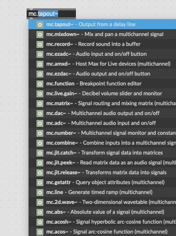
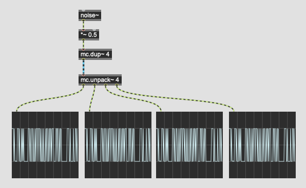
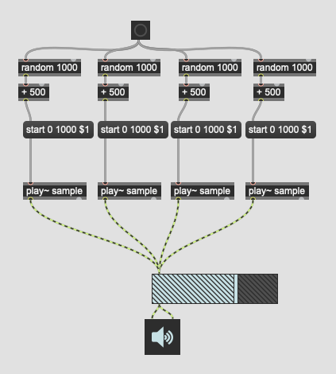
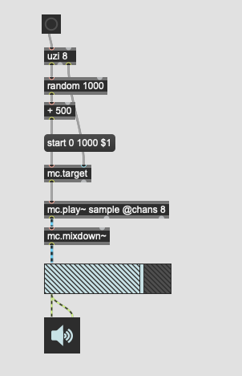
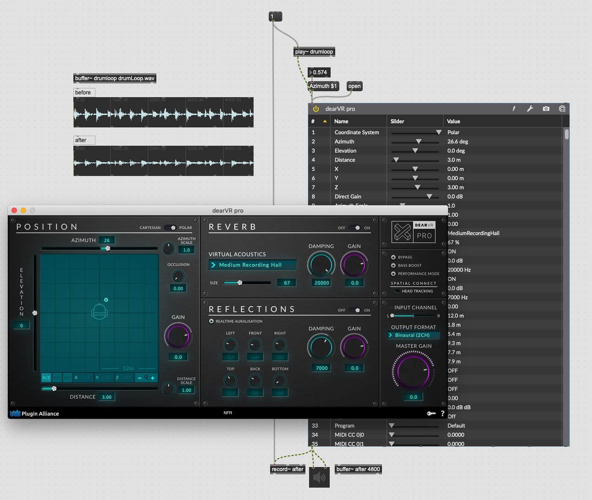

# What's new in Max 8

 
# MC = multi channel

## Das blaue Kabel

### mc.pack~ und mc.unpack~
 

einpacken/auspacken
 
### mc.lores~
 

 
 hier sind mehrere Instanzen von mc.lores~ nicht nötig.
 
### mc.target
 

Parametersteuerung pro Kanal.

### mc.dup~

kanal duplizieren

### meter~ und levelmeter~

 
### multigain~

## Anwendungsbeispiel

### Vocoder

#### Before

#### After

### Massive Sample

#### Before

#### After

# vst3 support

