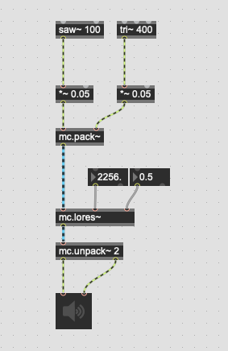
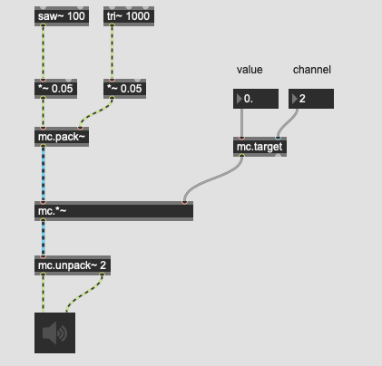
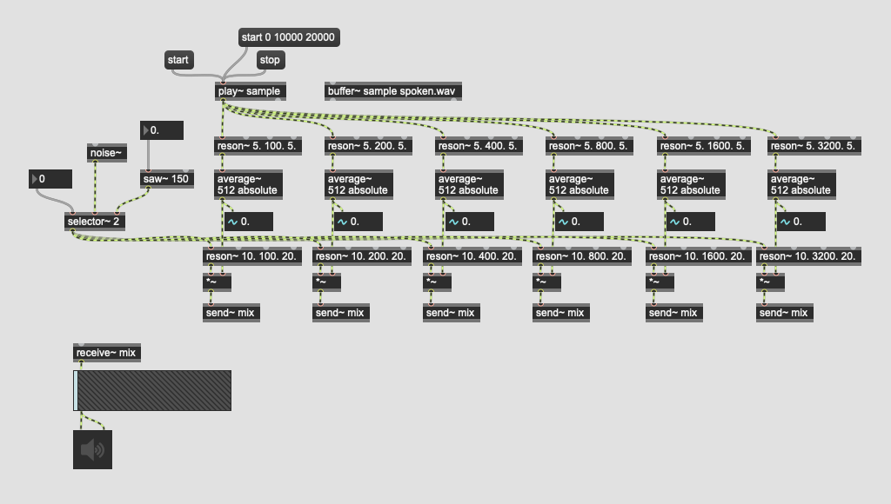

# What's new in Max 8

 
## MC = multi channel

## Das blaue Kabel

## mc.pack~ und mc.unpack~
 

einpacken/auspacken
 
## mc.lores~
 

 
 hier sind mehrere Instanzen von mc.lores~ nicht nötig.
 
## mc.target
 

Parametersteuerung pro Kanal.

# Anwendungsbeispiel

## Vocoder

### Bevor

### Nachher