# Stimmeanalyze
 
## Trennung von Konsonanten und Vokale mit buffer~

### zerox~

Die Abtastrate von zerox~ -> abhängig von Signal Vector Size aber nicht synchronisiert mit SV.

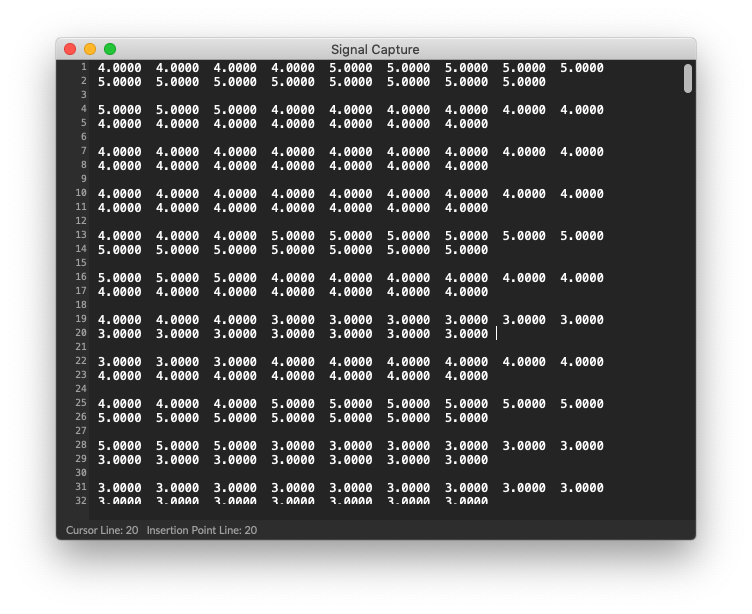

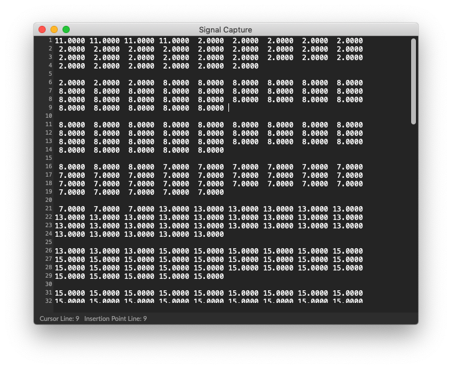

### adstatus

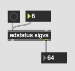

Signal Vector Size ist einstellbar in einem Patch

### zerox~ Aufname

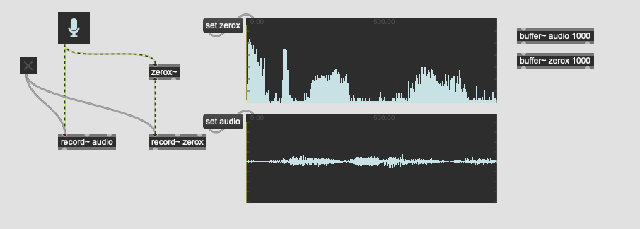

### Wiedergabe nur mit Konsonanten

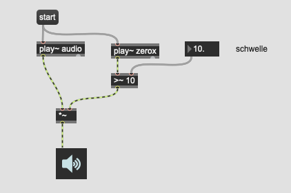

### oder Vokale

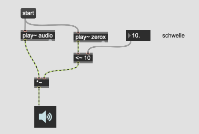

### Smoothing

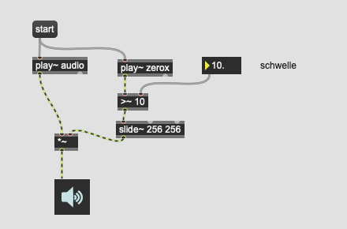

## Rhythmische Analyze

###  Amplitude envelope

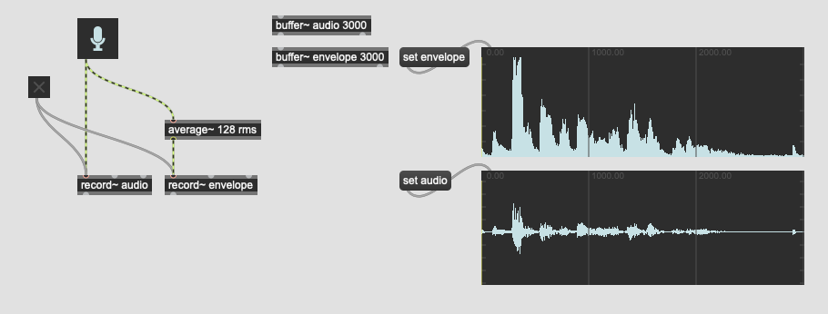

### Trigger

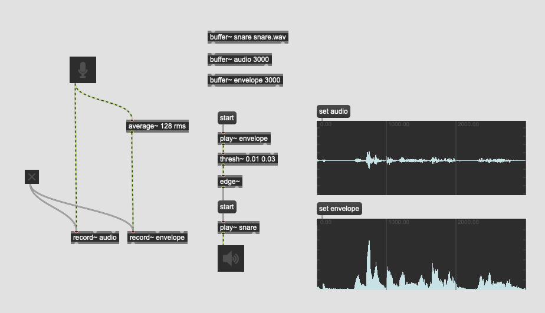

### Multi Voice

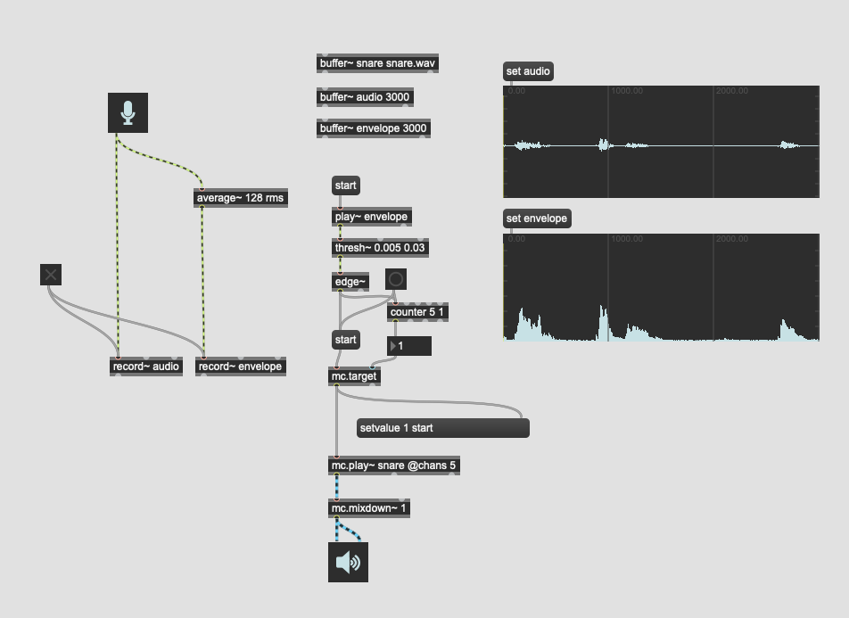

### Mapping

[Vinko Globokar - Toucher](https://www.youtube.com/watch?v=XbsXAgIuTm0)

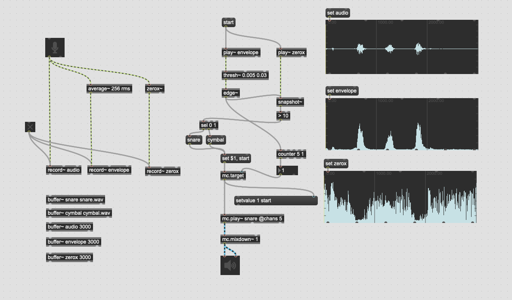

### Pitch Mapping

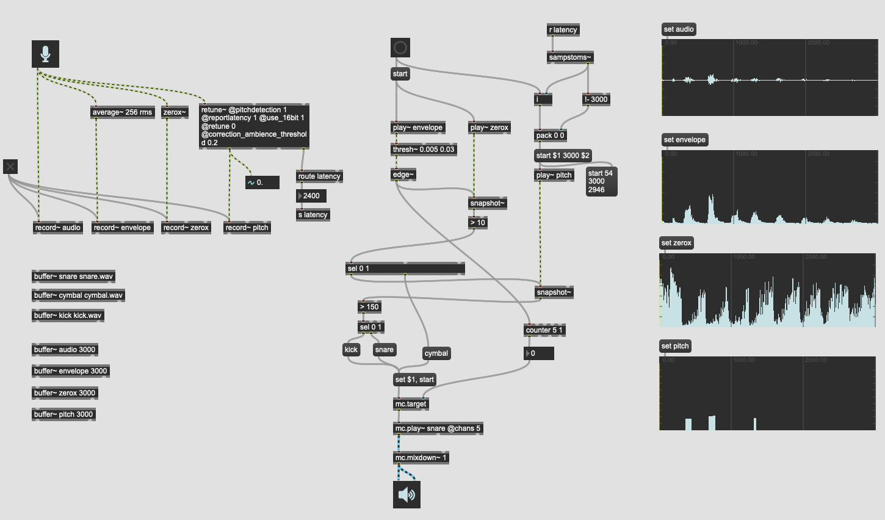

