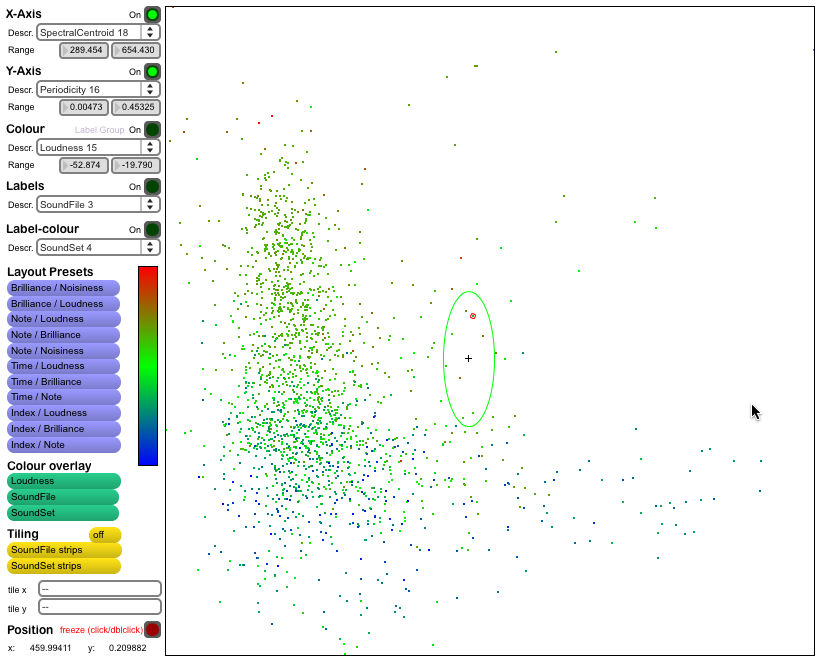
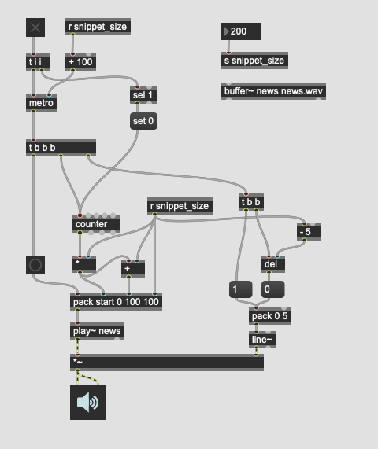
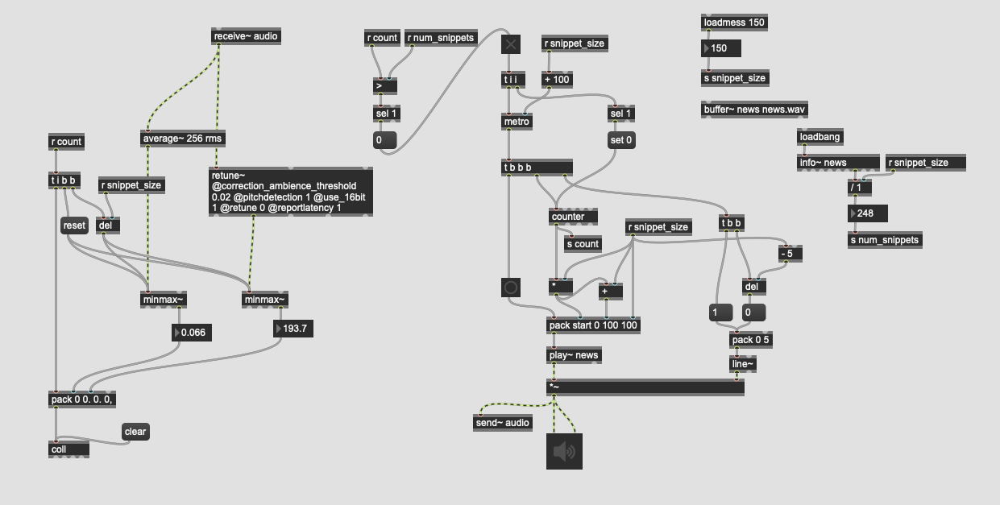
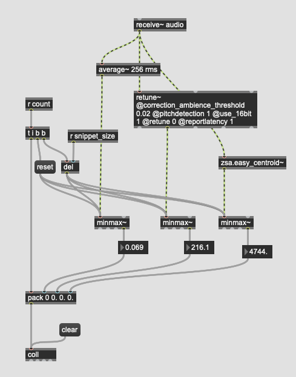
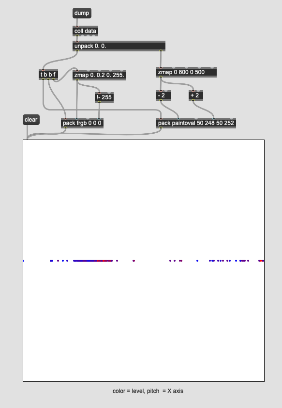
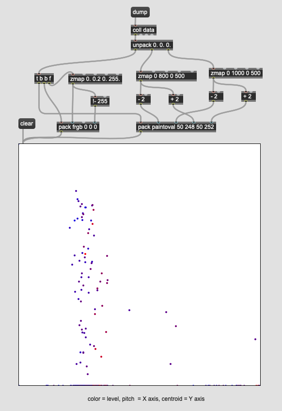
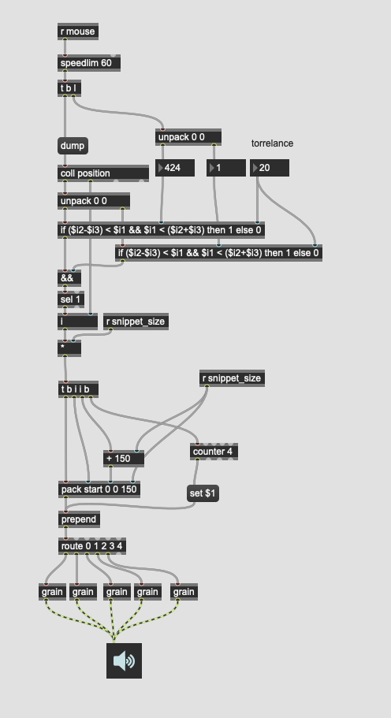

# Corpus Based Concatenative Sysntehsis 

[Trevor Wischart - Fabulous Paris](https://www.youtube.com/watch?v=D31C4TQ-9U4)

Corpus-based concatenative sound synthesis methods make use of a variety of sound snippets in a database to assemble a desired sound or phrase according to a target specification given in sound descriptors or by an example sound.

[Corpus-based synthesis](http://imtr.ircam.fr/imtr/Corpus-Based_Sound_Synthesis_Survey)

[Cata RT Teaser](https://www.youtube.com/watch?v=cWXdTlu_n44)

## Snippet Maker

## Snippet Descriptor

## zsa descriptor

## Visualisierung

## 3D Visualisierung

## Playback

### mouse position

### Snippet Suchung und wiedergabe

