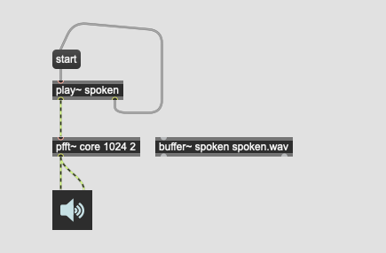
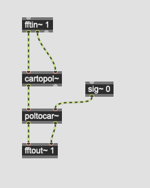
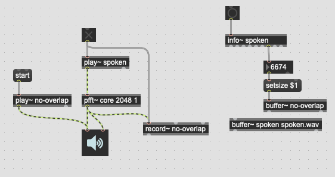
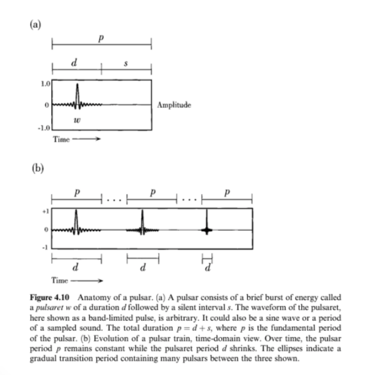

# Phase Bash 

Phase Bash von Miller Puckette

- FFT Phase Bashing
- Granular Sampling
- Weighting
- Pulser Synthesis

## FFT und Bashing

### phase bashing

### no-phase sample

## Pulser synthesis

## Weighting

## Overlap and Add

