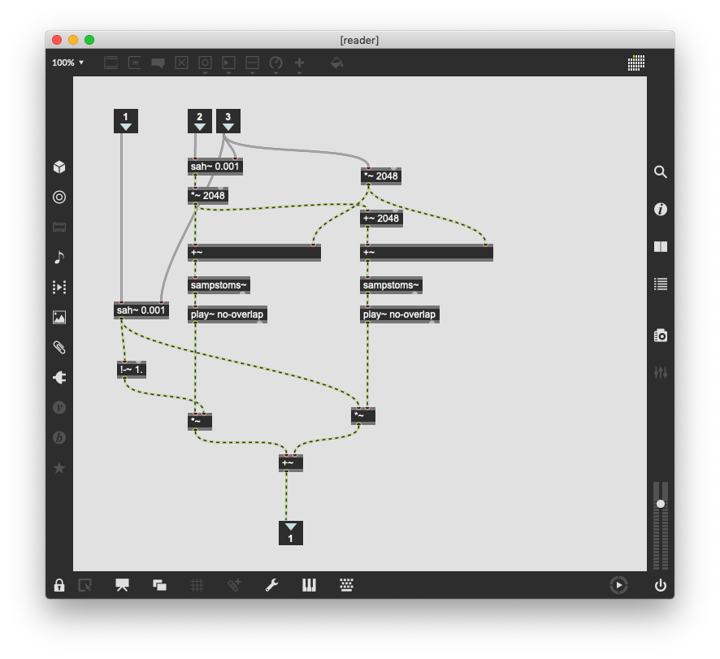

# Phase Bash 

Phase Bash von Miller Puckette

- FFT Phase Bashing
- Granular Sampling
- Weighting
- Pulser Synthesis

## FFT und Bashing

### phase bashing

### no-phase sample

pfft~ core führt "Fensterfunktion" aus aber keine Überlappung wegen "1".

### grain-aligned reader

### crossfade

### Overlap and Add

## Pulser synthesis

