# Klasse 6

## weitere Möglichkeiten mit poly~ 

## 1 Random Delay

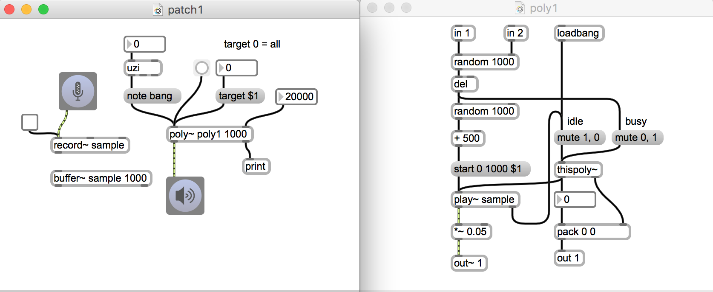

## 2 Ortung und poly~
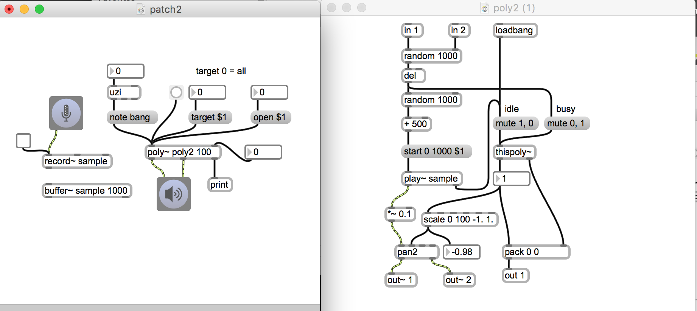

- jede Instanz hat unterscheidliche Position

## 3 Klangwolke
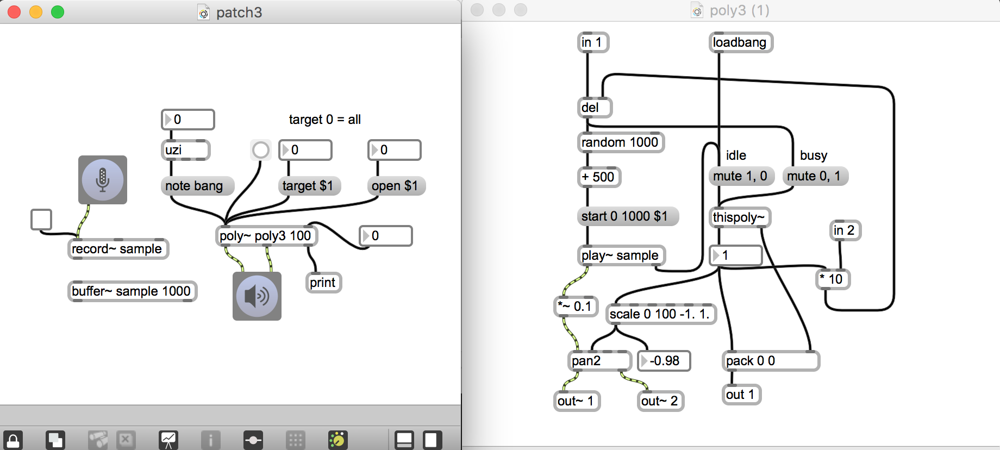

- Ligeti?

## 4 Delay designer
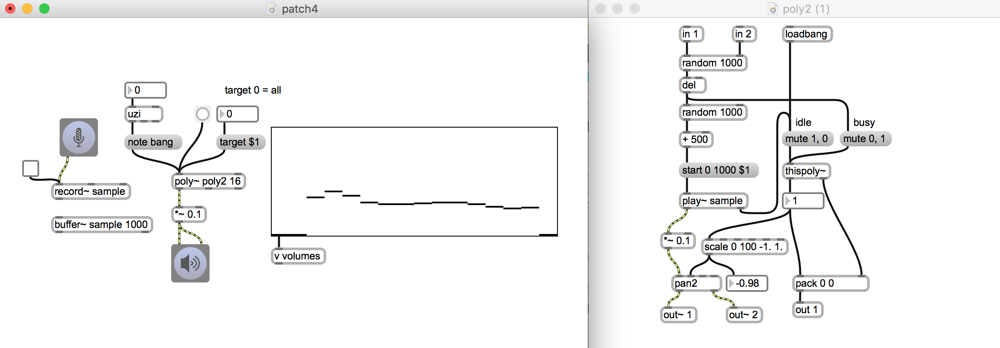

- Kombination mit multislider

## 5 Asynchonous Granular mit poly~
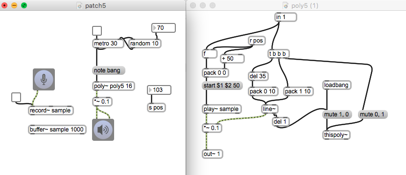

- mit poly~ kann man leicht Problem von der Überlapung lösen

## 6 Synchrnous Granular mit poly~
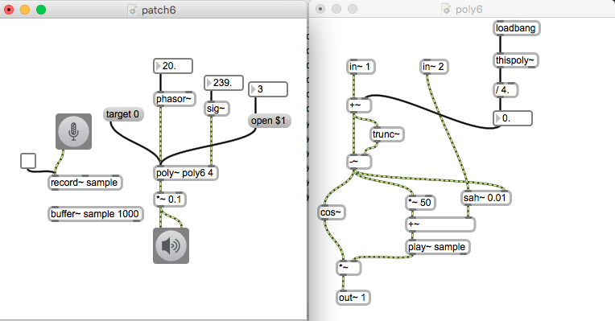

- Instanznummer als Parameter für Phasenvershiebung

## 7 Args und poly~
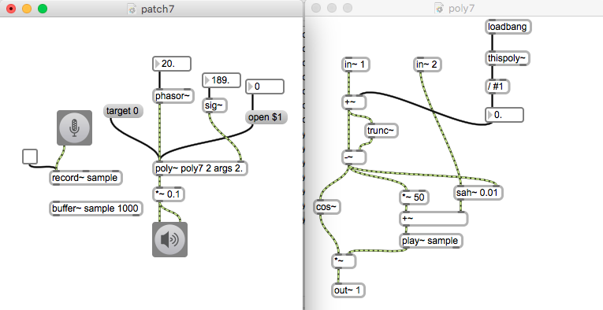

- poly~ kann auch Argumente nehmen

## 8 Unterschied zwischen note und midinote message

- note ... sucht die erste Instanz mit "Idle"-Status und schickt die eingegebene Aufgabe and diese Instanz

- midinote ... funktioniert wie note message aber midinote schickt MIDI note off message an die entsprechende Instanz.

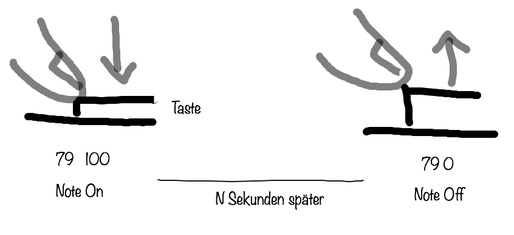

---
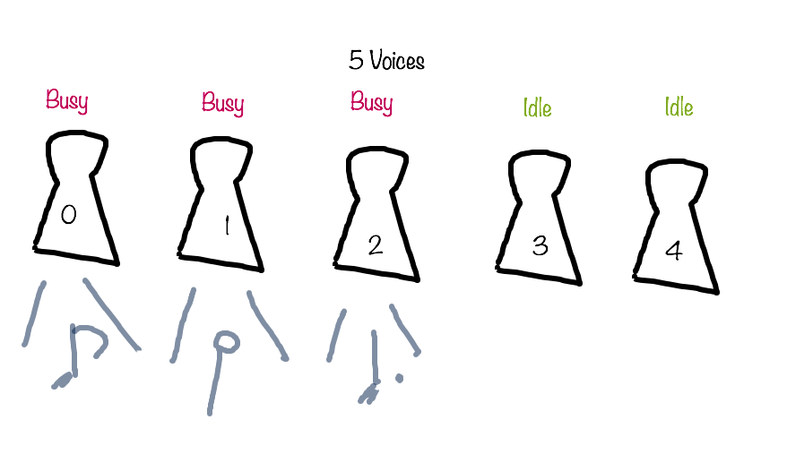

--- 

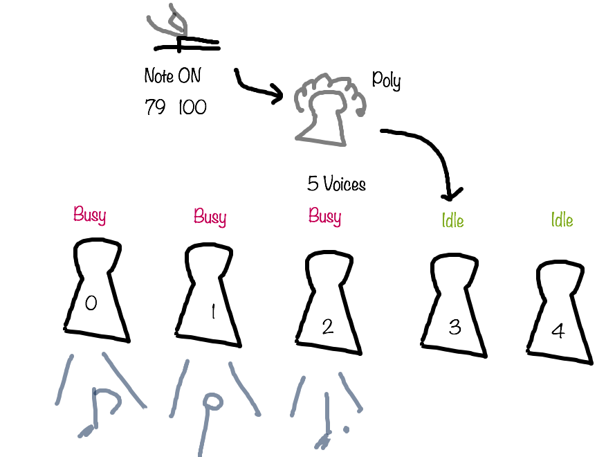

---
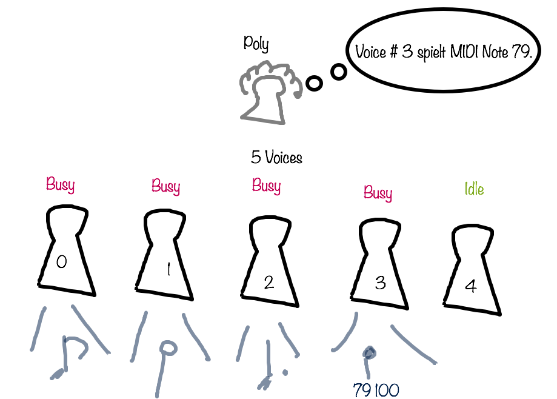

---

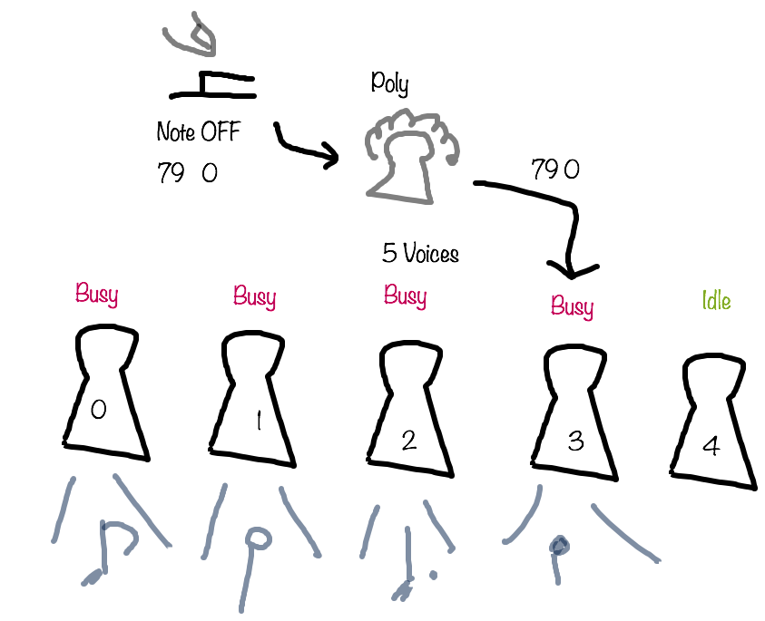

---

### Experiment mit note und midinote

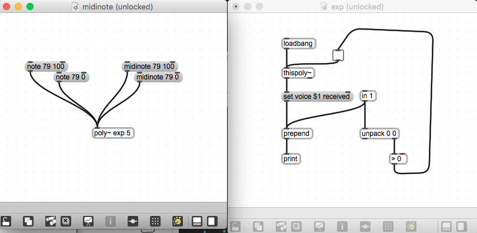

## 9 Polyphonischer Synth mit poly~
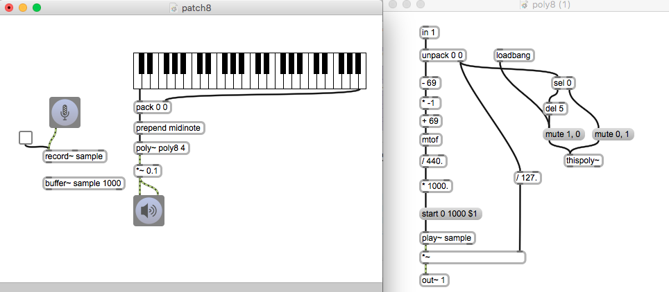

- polyphonischer Synth mit MIDI keyboard

## 10 Parallel Processing mit poly~

### Parallel Processing
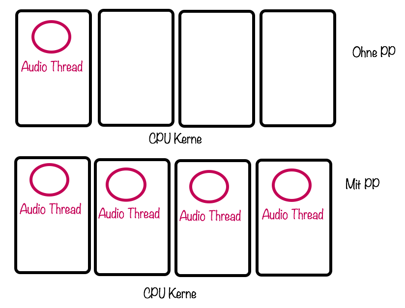

### Problem von Parallel Processing

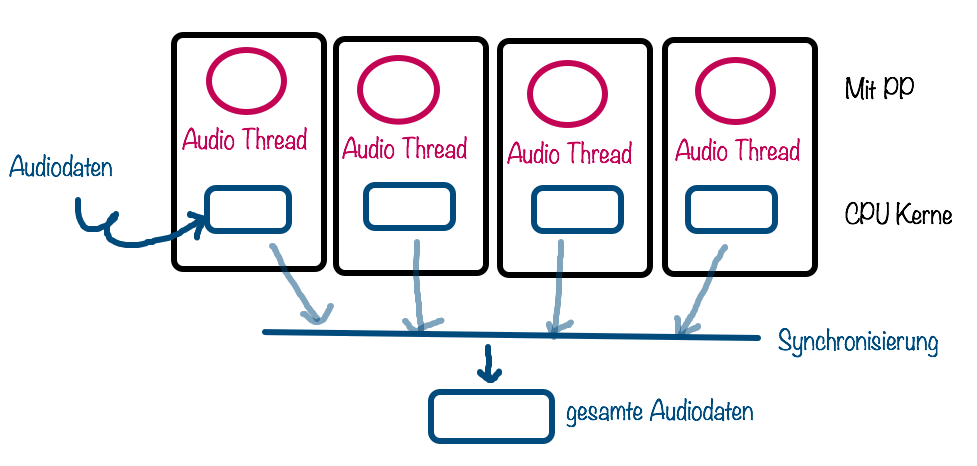

### Zwei Wege für Parallel Procerssing in Max

#### Enable Mixer Parallel Processing (ab Max 6)
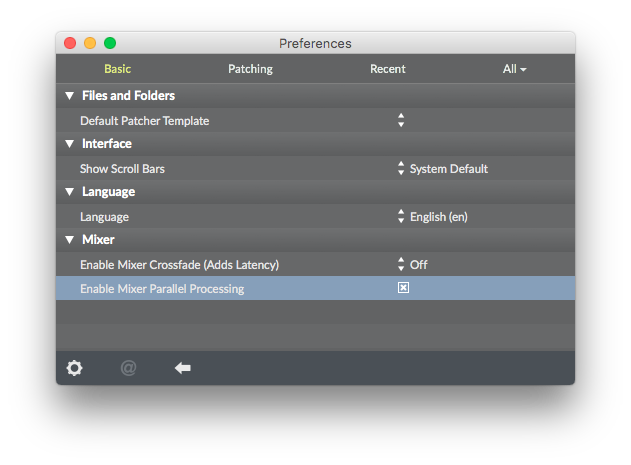
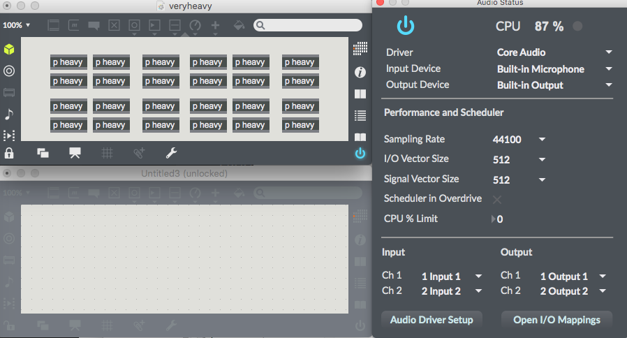
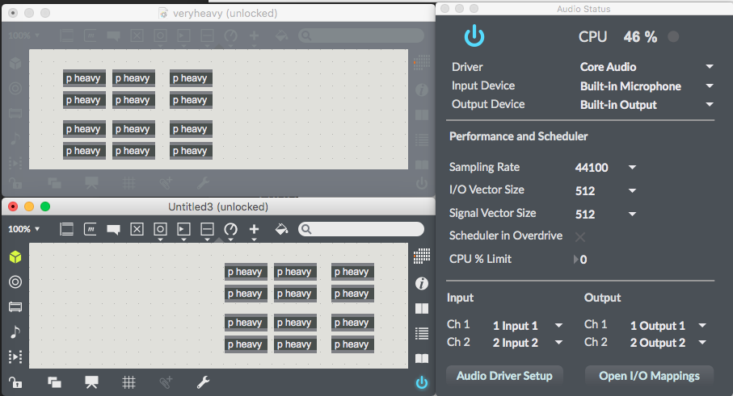

#### Parallel Processing mit poly~ 

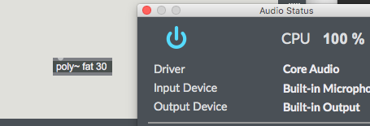
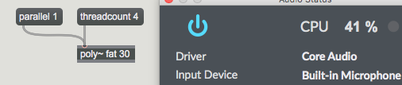

#### Parallel Processing mit poly~ 

- Vector Size 64

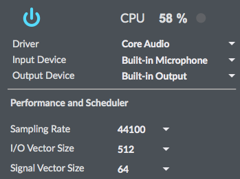

- Vector Size 512

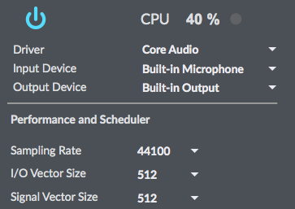

	    